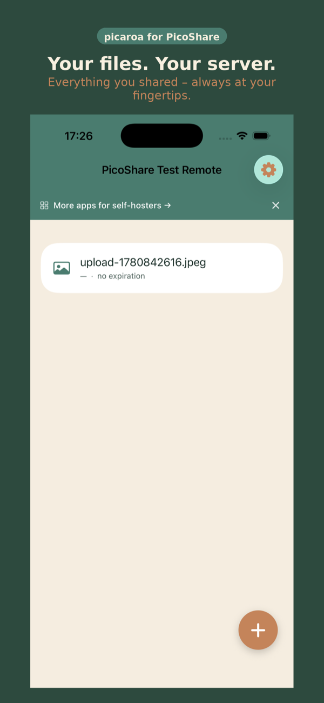
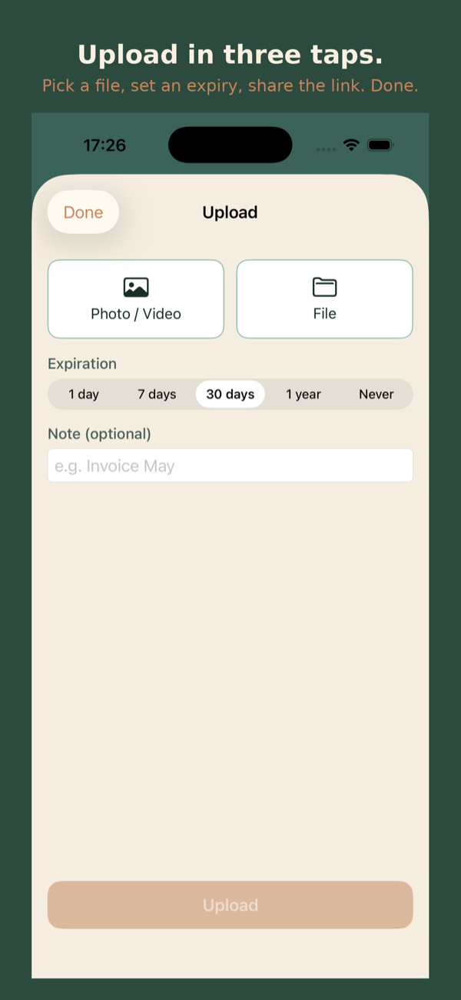
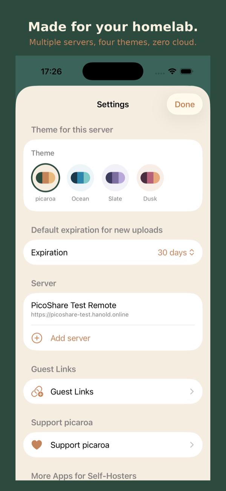

  

<h1 align="center">picaroa</h1>

<strong>Share files from your own server. No cloud required.</strong>

  A native SwiftUI client for <a href="https://github.com/mtlynch/picoshare">PicoShare</a> — upload and share files from your self-hosted server on iPhone.

  <a href="https://apps.apple.com/app/id6777667802?pt=128697224&ct=github-readme&mt=8">Download on the App Store</a>
  ·
  <a href="https://www.picaroa.app/en/">Website</a>
  ·
  <a href="https://www.picaroa.app/en/changelog/">Changelog</a>
  ·
  <a href="https://github.com/apps4selfhosted/picaroa/releases">Releases</a>
  ·
  <a href="https://github.com/apps4selfhosted/picaroa/issues">Report an issue</a>

---

> picaroa is an independent, unofficial community client. It is not part of the official
> PicoShare project — with respect and thanks to the team that builds and maintains it.

## Screenshots

<table>
  <tr>
    <td align="center"></td>
    <td align="center"></td>
    <td align="center"></td>
    <td align="center"></td>
  </tr>
  <tr>
    <td align="center">Files</td>
    <td align="center">Upload</td>
    <td align="center">Guest links</td>
    <td align="center">Settings</td>
  </tr>
</table>

## What it does

picaroa is the native iOS client for PicoShare, the self-hosted file sharing service. Upload a file,
pick an expiry, and the share link is in your clipboard seconds later — no cloud account, no
subscription, no tracking.

**Upload in seconds.** Photos, videos and documents from your library or the Files app. Several
files at once, or bundled into a single ZIP link, optionally password-protected. Share straight
from Safari, Photos, Files and any other app via the share sheet, with an expiry of 1 day up to
never.

**Guest links.** Let others upload files to your server without an account, and decide how long
the link and the uploaded files stay available.

**All your files at a glance.** Search, sort and filter by name, date, size or type. Preview
images, PDFs and videos in the app, show any link as a QR code, and see how often a file was
downloaded when your server supports it.

**Works even when the server doesn't.** Uploads wait in an offline queue and are sent
automatically once the server is reachable again.

**Privacy first.** picaroa talks only to your own PicoShare server. Your shared secret lives in the
iOS Keychain, and GPS and camera metadata can be stripped from images before uploading. Several
servers and four themes — each with a dark variant — are built in.

## Requirements

- A reachable [PicoShare](https://github.com/mtlynch/picoshare) instance — home network, VPN or public
- iOS 26.5 or later
- Free, no ads. Optional tip in the app to support development.

## Support

This repository is the public place for bug reports and feature requests:

- 🐞 [Report a bug](https://github.com/apps4selfhosted/picaroa/issues/new?template=bug_report.yml)
- 💡 [Request a feature](https://github.com/apps4selfhosted/picaroa/issues/new?template=feature_request.yml)
- ❓ [Frequently asked questions](https://www.picaroa.app/en/faq/)

Prefer not to post publicly? The [support form](https://www.picaroa.app/en/support/) reaches the
same place privately. Replies usually within one to two days.

The app's source code is not hosted here — this repository exists for support, documentation and
releases.

## Related apps

Other native iOS clients for self-hosted services, by the same developer:
[Mobile MA](https://www.mobile-ma.app/) (Music Assistant) ·
[dock-g](https://www.dock-g.app/) (Dockge) ·
[gyokuro](https://www.gyokuro.app/) (Gitea/Forgejo) ·
[BookStax](https://www.bookstax.app/) (BookStack) ·
[DockTrace](https://www.docktrace.app/) (Dozzle)

---

© 2026 Sven Hanold · Apps4Selfhosted

